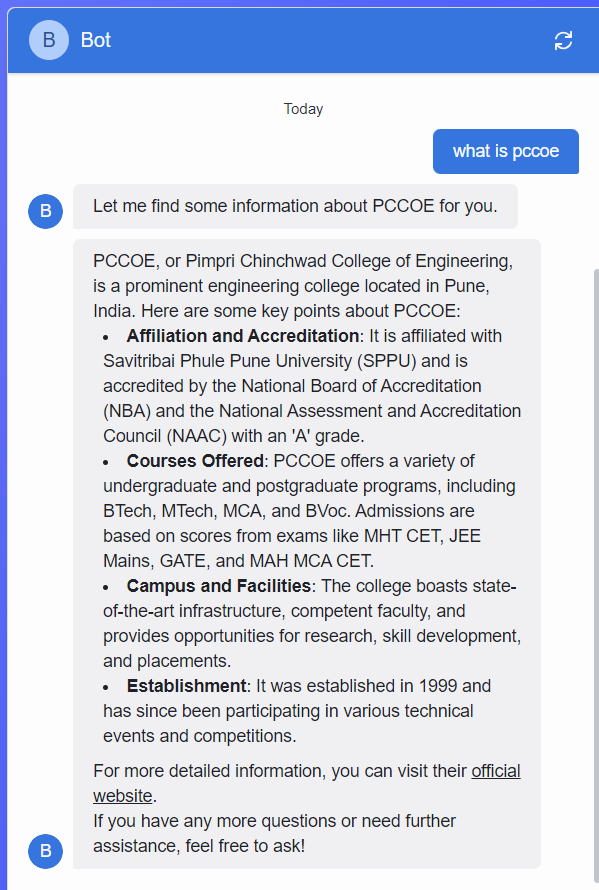

[Team ID]: 21
[Team Name]: Team Xspark
[Problem Statement Title]:  Design and Develop an AI-Powered Chatbot for PCCOE
Description:
This project involves the design and development of an AI-powered chatbot for Pimpri Chinchwad College of Engineering (PCCOE). The chatbot uses Flask, natural language processing (NLP), and a mock database to answer user queries related to the college, such as admissions, scholarships, and courses.

Features:
Web-based chatbot interface for user interaction.
NLP-based query processing.
Simulated responses using a mock database containing PCCOE-related information.
Intelligent fallback responses powered by the NLP model when information isn't available in the mock database.
Tech Stack:
Flask: For managing HTTP requests and serving the chatbot interface.
Transformers (NLP): To handle user queries and generate intelligent responses.
Mock Database: A simulated database to store basic information related to the college.
Rasa: Used for advanced NLP capabilities in handling chatbot conversations.
Screenshots:

Deployed URL:
https://drive.google.com/drive/folders/1EeP97ghh-AMtpyh9lQ64rJiHbqMhZGtc?dmr=1&ec=wgc-drive-hero-goto

Video URL:
https://drive.google.com/drive/folders/1EeP97ghh-AMtpyh9lQ64rJiHbqMhZGtc?dmr=1&ec=wgc-drive-hero-goto

Run Commands:
Follow these commands to set up and run the project:

bash
Copy code
# Install required libraries
pip install flask transformers
pip install flask rasa
pip install rasa

# To run the chatbot locally
python app.py
Remarks:
The chatbot can be further enhanced with additional features such as multi-language support, database logging, and integration with PCCOE's actual data sources. This project provides a solid foundation for an AI-driven query handling system.

Thank you!
Team Xspark (Team ID: 21)

